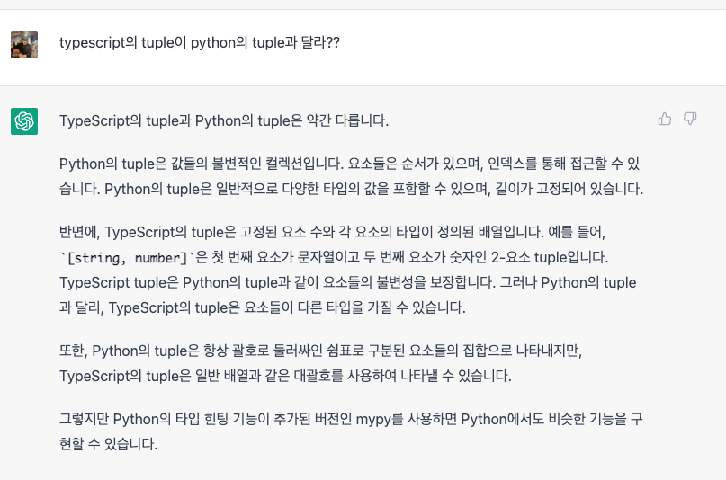
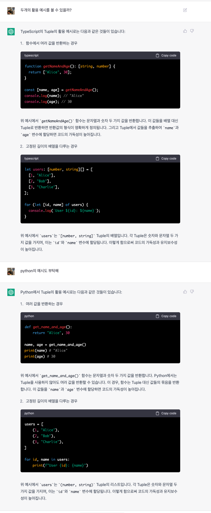

# lengthOfTuple

/*
  18 - Length of Tuple
  -------
  by sinoon (@sinoon) #쉬움 #tuple

  ### 질문

  배열(튜플)을 받아 길이를 반환하는 제네릭 `Length<T>`를 구현하세요.

  예시:

  ```ts
  type tesla = ['tesla', 'model 3', 'model X', 'model Y']
  type spaceX = ['FALCON 9', 'FALCON HEAVY', 'DRAGON', 'STARSHIP', 'HUMAN SPACEFLIGHT']

  type teslaLength = Length<tesla>  // expected 4
  type spaceXLength = Length<spaceX> // expected 5
  ```

  > GitHub에서 보기: https://tsch.js.org/18/ko
*/

/* _____________ 여기에 코드 입력 _____________ */

type Length<T extends readonly string[]> = T['length'];

/* _____________ 테스트 케이스 _____________ */
import type { Equal, Expect } from '@type-challenges/utils'

const tesla = ['tesla', 'model 3', 'model X', 'model Y'] as const
const spaceX = ['FALCON 9', 'FALCON HEAVY', 'DRAGON', 'STARSHIP', 'HUMAN SPACEFLIGHT'] as const

type cases = [
  Expect<Equal<Length<typeof tesla>, 4>>,
  Expect<Equal<Length<typeof spaceX>, 5>>,
  // @ts-expect-error
  Length<5>,
  // @ts-expect-error
  Length<'hello world'>,
]

/* _____________ 다음 단계 _____________ */
/*
  > 정답 공유하기: https://tsch.js.org/18/answer/ko
  > 정답 보기: https://tsch.js.org/18/solutions
  > 다른 문제들: https://tsch.js.org/ko
*/

## 알게된 점

- tuple이 내가 알고 있는 파이썬의 tuple 개념과 같은지 궁금했다. gpt를 통해 해결할 수 있었다. 아직은 어색한 ts의 문법에 조금 더 친숙하게 다가갈 수 있었다.
	
	
- 저번주는 number가 있었고 이번주는 length가 있었다. 또 다른 keyword가 있는지 공부해보면 좋을듯 하다.

## 참고